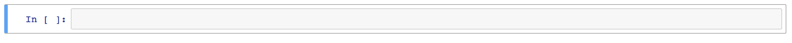
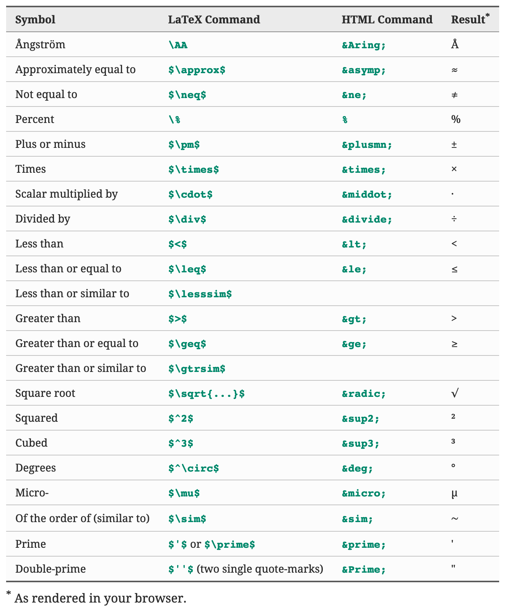

## Introduction to Jupyter Notebok and Markdown Language 
---
Jupyter Notebook is an open source web application which allows you to run code intractviely within web browser, with visualization and with smart markdown text to explain what is going on with the process you are working on. In other words it provides a unified working environment in which you can create documents which contains text,codes, mathamtical calculations,graphics, and also the result of the execuations of the code [1].<br>

This makes Jupter Notebook a handy tool for performing end to end data science workflows, data cleaning, statistical modeling, building and training machine learning models, visualizing data, and many, other uses [7]. It become the *de facto* for doing intractive data science and sharing the results with others

Jupter Notebook process is developed from **IPython**, each notebook is associated with a single **kernal** (A kernel is a “computational engine” that executes the code contained in a notebook document)[1]. <br>
for example notebook which uses Python programming language is associated with IPython kernal, therefor it runs Python code.
### Supporting Programming Languages
The Notebook has support for over 40 programming languages, including Python, R, Julia, and Scala [7]
**Note:** 
> We are going to work only with Python in this course.
---
## How To Install Jupyter Notebook
<!-- JupyterLab which was released April 2018, which is the successor for Jupyter Notebook. Jupyter Notebook whas build in 2012, and the web was undergo a lot of changes sice 2012. <br> -->


The best way to install Jupyter Notebook is through the use the Anaconda distribution to install both Python and the notebook application. offcourse you can still install it through PIP.
[Downlaod Anacoda Applicaiton](https://www.anaconda.com/products/individual)
[1]


---
The advantage of Anaconda is that you have access to over 720 packages that can easily be installed with Anaconda's conda, a package, dependency, and environment manager.
---
You can also use Jupyter Notebook online:
[Try Jupyter Notebook ONline](https://jupyter.org/try)
<br>


<br>
## Markdown 
Jupyter Notebook supports a type of writing language called **Markdown**. It is a simple way of creating nice looking documents with a small number of __commands__ to remember.

Markdown’s syntax is intended for one purpose: to be used as a format for writing for the web. Markdown is not a replacement for HTML, or even close to it. Its syntax is very small, corresponding only to a very small subset of HTML tags. The idea is not to create a syntax that makes it easier to insert HTML tags. In my opinion, HTML tags are already easy to insert. The idea for Markdown is to make it easy to read, write, and edit prose. HTML is a publishing format; Markdown is a writing format. Thus, Markdown’s formatting syntax only addresses issues that can be conveyed in plain text [8]. Keep in mind that for any markup that is not covered by Markdown’s syntax, you simply use HTML itself.


Markdown it text tool which converts text to HTML. The idea behinde markdown language is to make it as simple and readable as possible as stated ***JHONE GRUBER*** the creator of Markdown language (2004) [2]. 


`Jhone Gruber, the created of Markdown.<br> source:Wikipedia.org`


One important thing about Markdown is that you can write the document in plain-text format and publish it as it is, there is no need to explain any thing or removing any tags like it HTML [3].
> For mor Informaiton please visit these URLs. <br>
> [Wikipedia Markdown](https://en.wikipedia.org/wiki/Markdown). here there is a good compersion between  <br>
> [The Markdown Movments](http://aaronbeveridge.com/markdown/index.html)


---
### Writing in Jupyter Notebook
---
A cell is a container for text to be displayed in the notebook or code to be executed by the notebook’s kernel. Cells form the body of a notebook. For example cells allwo us to enter and run code, after you write your code just click on **Shift-Eener** <br>
There are two other keyboard shortcuts for running code:
> **Alt-Enter** runs the current cell and inserts a new one below <br>
> **Ctrl-Enter** run the current cell and enters command mode.
There are two main cell types:
* A code cell contains code to be executed in the kernel. When the code is run, the notebook displays the output below the code cell that generated it.
* A Markdown cell contains text formatted using Markdown and displays its output in-place when the Markdown cell is run.
---
It is important to know that the first cell in a new notebook is always a code cell. That is why when you open Jupyter Notebook, a simple code box will be opened, which means you can start writting code.

When we run the cell, its output will displayed and the label to its left will have changed from **In [ ]** to **In [1]**.
* <span style="color:green;">**Green**</span> outline — cell is in "edit mode"
* <span style="color:blue;">**Blue**</span> outline — cell is in "command mode"

you can change, from coding to writing text clicking on Cell from the menu and choosing type then markdown

You will notice that the square bracket to the left of the cell has disappeared, meaning we now have a text box to write in:
---
Now, click in the cell, (its border will turn green) a cursor will appear and you can type anything you like:

Now, you will notice that the text looks a little different from the font I am using here. That's because you're editing the source code, and it has not yet been rendered. In order to see what the finished product will look like, click the 'play' button, click 'Cell > Run Cell' or type 'Ctrl-Enter', and hopefully you will see:

To edit the text in the cell, simply double click it again. You can make changes, and then click the 'play' button, click 'Cell > Run Cell' or type 'Ctrl-Enter' again to see your changes.
---
## Headings

# Heading level 1
## Heading level 2
### Heading level 3
#### Heading level 4
##### Heading level 4
###### Heading level 6

[4]
### بسم الله الرحمن الرحيم
راح نستخدم بعض العمليات الحسابية
----
you can also use the following syntax for heading level 1 and heading level2

Heading level 1
===============

Heading level 1
---------------

[4]
---
## Bold and italics
To make text bold enclose it between two asterisks:

** bold **

Or to italicise, use one asterisk

* italics *

(This also works in whatsapp by the way)

You can make bulleted lists using asterisks:

to mark each point

* bullet 1

* bullet 2

## Making titles
### and subtitles
You make titles using hashtags. A single hashtag gives you a title, two hastags gives you a subtitle and so on as shown below:

# Title

## Subtitle

### SubSubtitle

[4]
---
## Emphasis
You can add emphasis by making text bold or italic.

for bold text <br>
This is very **Important** text <br>
This is very __Important__ text <br>

---
for italic text<br>
This is very *Important* text<br>
This is very _Important_ text<br>

[4]
---
## Including Images

From the Internet direct link


Localy stored on your computer


[4]
---
## Embeded Youtube Vides
While its not possible to embed a video in markdown, the best and easiest way is to extract a frame from the video, add a layer with a play icon and link the video url on the image.
```[]({video-url} "Link Title")```

you can embed youtube videos using the following code:<br>
```[](http://www.youtube.com/watch?v=YOUTUBE_VIDEO_ID_HERE) ```

---


[](http://www.youtube.com/watch?v=jBCB23pQeIA)

[5]
You can also use the following code, to add a local vidoe:<br>
```

```

```
!video[ title ]( url ){ size=10 }

```

---


---
Click on the link to play the video
video [To play the video click here](v1.mp4)

[5]
## Sounds files
----

`!audio[ title ]( url ){ size=10 duration=10 cycle=forever }`
<br>

!audio[Please click here to play the audio file](media/m1.mp3 ){ size=10 duration=10 cycle=forever }

[6]


---

### Tables
Markdown table syntax is quite simple. It does not allow row or cell spanning as well as putting multi-line text in a cell. The first row is always the header followed by an extra line with dashes "-" and optional colons ":" for forcing column alignment. in simple words tables are created using pipes (|) and dashes (-), with colons (:) used to align cell contents. 
| No   | Name       |  GPA |
|:----:|:----------:|:----:|
| 1   | Nasser      | 95   |
| 2   | Salim       | 81   |
| 3   | Ahmed       | 90   |
| 4   | Mona        | 75   |
| 5   | Fatima      | 66   |
| 5   | Salma       | 80   |
### Table Alignment

You can align text in the columns to the left, right, or center by adding a colon (:) to the left, right, or on both side of the hyphens within the header row.

| Name       |   Job   |      Address |
|:---        |  :---:  |          ---:|
|Nasser.     |Lecturer.|      Salalah |
## Table Generator

you can use Table generator to automatically creates table for just visit the below link.<br>

[Click here to generate tables]("https://www.tablesgenerator.com/markdown_tables)
### footnotes (in jupyter notebook)


---
### mathematical symbol for 'power' (like X ^ 2) 
we can use:<br>
x<sup>2</sup>  <br>
y<sup>8</sup>   <br>
log<sup>n</sup>  <br>

### Here's a short list of LaTeX and HTML commands for producing the symbols often used when writing up papers or making scientific webpages.


---

The source for the incomeing example is:
<br>
https://www.youtube.com/watch?v=5Uqawfl0VHQ
import numpy as np
import matplotlib.pyplot as plt
%matplotlib inline
t=np.arange(1,100000)
def logarithmic(x):
    return np.log(x)
a=np.empty(99999)
a.fill(10)

def polynom(x):
    return x**2

def loglin(x):
    return x * np.log(x)

def exponential(x):
    return 2**x
plt.plot(t, logarithmic(t), label='Logarithmic')
plt.plot(t,a,label='Constant')
plt.xlim(-1000,100000)
plt.legend(loc='lower right')
plt.xlabel('Number of Inputs')
plt.ylabel('Time')
plt.title('Comparison of Constant and Logarithmic')
plt.show()
we have 10 times units(can be mill seconds or any thing else) for constant algorithm, then for Logarithmic it is constant till we reach 20000 imput it reaches 10 time uint then start to increase gradually but still under 12 times units. we can see it secals so solwlly at the time side, that is why logarithmic algorthim is so usefull when you writting algorithms. we notice that the time scales very well  in terms of time complexity when the amout of data increased


---
#### now we are going to compare Log and linear
t_1=np.arange(1,1000)
plt.plot(t_1, logarithmic(t_1), label='Logarithmic')
plt.plot(t_1,t_1,label='Linear')
plt.xlim(0,1000)
plt.legend(loc='upper left')
plt.xlabel('Number of Inputs')
plt.ylabel('Time')
plt.title('Comparison of Log and Linear')
plt.show()
Notice: that we come down from 100000 to 1000 inputs. and we notice that there is almost no chaning in time with log, and there is a daramtic change with liner as the input icreased the time time increased too if you notice in the previous figure we are only 12 units of time, and in the second figure we reached 1000 unit of time. It is ok if the unit of times are milli of seconds, but if the time units is minuts or hours or days that is not ecceptable at all.
---
#### now we are going to compare linear and loglinear
t_1=np.arange(1,1000)
plt.plot(t_1, loglin(t_1), label='Log-Linear')
plt.plot(t_1,t_1,label='Linear')
plt.xlim(-10,1000)
plt.legend(loc='upper left')
plt.xlabel('Number of Inputs')
plt.ylabel('Time')
plt.title('Comparison of Linear and Log Linear')
plt.show()
#### now we are going to compare Quadratic and loglinear
plt.plot(t_1, loglin(t_1), label='Log-Linear')
plt.plot(t_1,polynom(t_1),label='Quadratic')
plt.xlim(-10,1000)
plt.legend(loc='upper left')
plt.xlabel('Number of Inputs')
plt.ylabel('Time')
plt.title('Comparison of Quadratic and Log Linear')
plt.show()
we can sea that Quadratic scalling up as we increase the number of inputs


t_2=np.arange(63)
plt.plot(t_2, exponential(t_2), label='Exponential')
plt.plot(t_2,polynom(t_2),label='Quadratic')

#plt.yscale('log')
#plt.xlim(-10,1000)
plt.legend(loc='upper left')
plt.xlabel('Number of Inputs')
plt.ylabel('Time')
plt.title('Comparison of Linear and Log Linear')
plt.show()
with exponential algorithms the time shots up to 10 to power 18 on the time scal
---
### Here we are going to give example on binary research
import math
print(math.log(10,10))
print(math.log(100,10))
print(round(math.log(1000,10),2))
print(math.log(10000,10))
in the example above what are basiclly saying is that with log base 10, what is the power need to to get 10,100,1000,1000:<br>
<br>
the result of these are:<br>
1.0 <br> 
2.0 <br>
3.0 <br>
4.0 <br>


so as our numbers scaled or increased by a factor of 10, (10,100, 1000,10000), our lograthim scaled by a factor of 1  (1 to 2, to 3 to 4 we only need to add 1), which is pretty usefull if we think about bout , as the amout of data increased our logrithm sacled by factor of one

keep in mind that:<br>
10<sup>1</sup> is equal to 1<br>
10<sup>2</sup> is equal to 2<br>
10<sup>3</sup> is equal to 3<br>
10<sup>4</sup> is equal to 4<br>
<br>

here the base is 10 so: <br>
log10=1<br>
log100=2<br>
log1000=3<br>
log10000=4<br>
<br>


Notice: the values double each time, but the logrithm is going linearly, which gives binarly research a good advance and usefull sort of research
print(math.log(2,2))
print(math.log(4,2))
print(round(math.log(8,2),2))
print(math.log(16,2))
In the previous example we have log to base 2, which scales like this:<br>
* log 2 to based 2  is 1.0
* log 4 to based 2  is 2.0
* log 8 to based 2  is 3.0
* log 16 to based 2  is 4.0

<br>
here for example we are saying is that what power needed to raise 2 to 2, and 2 to 4 and 2 to 8 and 2 to 16<br>

* 2<sup>1</sup> is equal to 2 
* 2<sup>2</sup> is equal to 4
* 2<sup>3</sup> is equal to 8
* 2<sup>4</sup> is equal to 16

<br>

even the value double each time but the logrithm is going linearlly. <br>
that means as the numbers in our list for example doubles, can be one million to two million and so on, but our logrithm is going linearly by one only which is pretty handy and important.which gives binarly research a good advance and usefull sort of research

In the example below we have a list of 1000 memeber or element, those elements got a value between 0 and 5000. in other words we have alist with a length of 1000, and the numbers values in each itme of the list can take a value from the range of 0 to 5000, byt they have been randomly selected by in asanding order(which important in binary search, the order should be asending)
import random
import math
large_list=random.sample(range(5000),1000)
here we making sure that the numbers in an asending order
large_list.sort()
#now we are going to select a number form the list in a random way, and we are going to search for it using binary search
print(random.randint(0,5000))
#notice to get the above number from the list of a 1000 members we need 9.965784284662087 steps which means 9 steps only
math.log(1000,2)
#checking is 
3557 in large_list
# looking at the middle value of the list which is 500
large_list[500]
now i know that 2507 i greater than 935 so i have to disregard any thing comes after 500, which the top part of the 1000, remember our list has 1000 items in it.
#here am slicing from 0 to 500 only and the top part 501 til 1000 is not included
large_list=large_list[500:1000]
# now again am looking at the middle value of the list which is 250 to see its value and it is 1332 which less than 1710, so i have to disregard to bottom part for the list and look at the top level part which starts from 256 till 500
large_list[735]
# here am slicing from 250 to 500 the upper part
large_list=large_list[0:250]
# checking the middle value from 250 to 500 which is 646 to see if it is equal to 1710, but it still less
large_list[125]
large_list=large_list[0:125]
the value with an index of 125 is 608 which is les that 1296, which means we have to go to upper have which is 63 ( 125/2=62.5 which we may consider equal to 63 this is the middle point
large_list[63]
large_list=large_list[0:63]
large_list[32]
large_list=large_list[0:32]
large_list[16]
large_list=large_list[0:16]
large_list[8]
large_list=large_list[0:8]
large_list[4]
large_list=large_list[0:4]
large_list[2]
large_list[1]
## References
----
[1] Karlijn Willems (Nov 12, 2019)Jupyter Notebook Tutorial: The Definitive Guide. Retreived From:https://www.datacamp.com/community/tutorials/tutorial-jupyter-notebook?utm_source=adwords_ppc&utm_campaignid=1455363063&utm_adgroupid=65083631748&utm_device=c&utm_keyword=&utm_matchtype=b&utm_network=g&utm_adpostion=&utm_creative=278443377095&utm_targetid=aud-299261629574:dsa-473406581035&utm_loc_interest_ms=&utm_loc_physical_ms=9069726&gclid=CjwKCAjw2Jb7BRBHEiwAXTR4jVoTyXwDCx9t-ihcmr6ZEb9Rb1WVYkDBueRbrgnp48QDbNfMXtNvxBoCUJ4QAvD_BwE##History
[2] Wikipedia.org(n.d) John Gruber. Retreived From:https://en.wikipedia.org/wiki/John_Gruber
[3] Wikipedia.org(n.d) Markdown. Retreived From:https://en.wikipedia.org/wiki/Markdown
[4] Markdownguide.org(n.d) Basic Syntax. Retreived From:https://www.markdownguide.org/basic-syntax/
[5] Stackoverflow.com (n.d)How can I embed a YouTube video on GitHub wiki pages?
 .Retrieved From:https://stackoverflow.com/questions/11804820/how-can-i-embed-a-youtube-video-on-github-wiki-pages
[6] Talk.commonmark.org (n.d) Embedded audio and video .Retrieved From:https://talk.commonmark.org/t/embedded-audio-and-video/441
[7] Siddhesh Chavan (Aug 21, 2018). Top 5: Online Notebook (ipynb) and other cloud services. Retrieved From:https://medium.com/@siddesh.001/top-5-online-free-notebook-ipynb-and-other-cloud-services-dbf9580d99e3
[8] Stackoverflow.com (2016). How to apply color in Markdown. Retrieved From:https://stackoverflow.com/questions/35465557/how-to-apply-color-in-markdown

